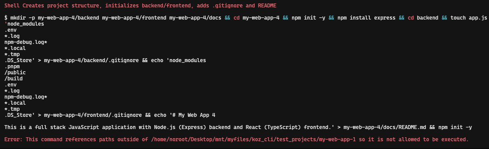

# README.md

Make sure that you installed https://ollama.com/ and https://opencode.ai/.

After that create virtual env, activate it and install requirements.

make sure that koz has at least 700 (chmod 700) permissions to be ran without calling python:

```bash
# instead of 
python koz up
# this
koz up
```

`koz model attach` — Connects local LLM. It uses either Ollama (recommended) or to “own” LLM with path to files. For Own LLM creates server that is partially compatible with Ollama. Supports both transformer model weights and GGUF.

`koz finetune codebase <path>` — Fine tuning model based on some codebase. URL is not supported. I chose https://github.com/fastapi/full-stack-fastapi-template repository to train model on.

Basically parses all code on the repository and asks attached model to create prompt that would generate given code. And after that fine-tunes given model on generated dataset. Fine tuning tested on qwen-2.5 models, should work on most LLMs that use Alpaca style prompt.

Supports output in GGUF format, but requires a lot of VRAM.

`koz init <project_name>` — inits project on chosen tech-stack, can use only Ollama model, own LLMs are not supported. Selected in Ollama model must be large, must have ability to think and use tools, other ways it will need access to the internet to use opencode/sonic.  

Mostly local LLMs are not intelligent enough to be used in opencode, so they give error like this:



here in image LLM tries to access folder outside of allowed directory and gets error, and it will try to do the same many times after, more intelligent models with (at least 30b or 72b) will not make same mistake.

`koz generat_module <modulename>` — generates module based on the YAML, first init project using koz init, cd to that directory and only then run this command.

`koz up / koz down` — runs/stops entire stack

make sure that demo.sh has at least 700 (chmod 700) permissions run

`./demo.sh` — demonstration, attaching model, making request to it, creating simple project.

`koz offline verify` — pings some sites and checks network connectivity.

`koz status` - shows status.